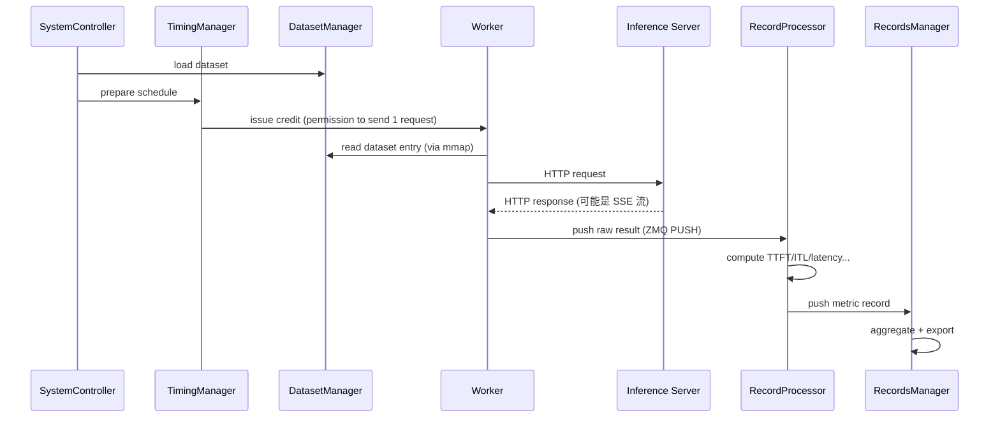
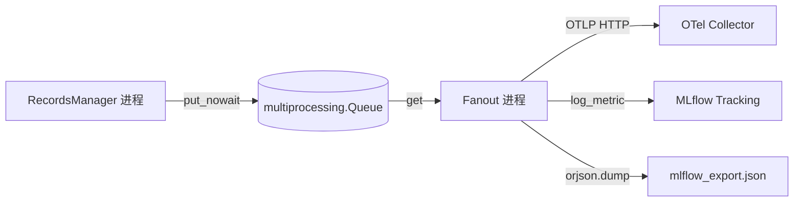

<!--
SPDX-FileCopyrightText: Copyright (c) 2025-2026 NVIDIA CORPORATION & AFFILIATES. All rights reserved.
SPDX-License-Identifier: Apache-2.0
-->

# 背景知识文档 — OTel + MLflow Telemetry Takeover

> 这份文档是为第一次接触 aiperf / OpenTelemetry / MLflow 的工程师准备的。
> 它不是 spec 的一部分(spec 是 `requirements.md` + `design.md`),而是帮你
> 建立足够的上下文去读懂、review、修改 PR 656 的代码。
>
> 阅读顺序建议:本文档 → `requirements.md` → `design.md` → PR 656 的 diff。

---

## 0. 这份 PR 在做什么(一句话)

在每次 `aiperf profile` 跑基准的时候,让它**同时**把实时指标流到 OpenTelemetry
Collector(Grafana / Prometheus 面板能用),把摘要指标和本地产物文件上传到
MLflow Tracking Server(实验追踪平台能用)。跑完之后 `aiperf plot --mlflow-upload`
还能把生成的图表附加回同一个 MLflow run。

```bash
# 用户最终会敲这样的命令
aiperf profile \
  --model Qwen/Qwen3-0.6B \
  --endpoint-type chat --url http://127.0.0.1:8000 \
  --concurrency 32 --request-rate 64 \
  --otel-url http://127.0.0.1:4318 \
  --mlflow --mlflow-tracking-uri http://127.0.0.1:5000 \
  --mlflow-experiment aiperf
```

---

## 1. AIPerf 是什么

AIPerf 是 NVIDIA 开源的**推理服务基准测试工具**,Python 3.10+,纯异步。
给你一个推理 endpoint(vLLM / TRT-LLM / Ollama / OpenAI 兼容 API 等),
它能按指定的并发数、请求速率、到达分布(Poisson / gamma / burst)发压,
采集每个请求的延迟、tokens、TTFT、ITL 等指标,最后输出 JSON/CSV/Parquet。

**关键事实**(读 PR 前必须知道):

1. aiperf 是**多进程**架构,不是单个大 asyncio 程序。跑一次 benchmark 会
   拉起 **9 个独立进程**(service),它们之间只通过 **ZMQ 消息总线**通信,
   不共享内存。
2. 进程之间的消息都是强类型的 Pydantic 模型,派生自 `Message` 类,在
   `src/aiperf/common/messages/` 里定义。
3. 可扩展点全部通过 **YAML plugin 注册表**(`src/aiperf/plugin/plugins.yaml`)
   声明。新增 endpoint、metric、dataset、results_processor、data_exporter
   都是"写类 + 在 yaml 里登记 + 导出枚举"三步。
4. PR 656 引入的 `OTelMetricsResultsProcessor` 和 `MLflowDataExporter` 就是
   两个新的 plugin——分别在 `results_processor` 和 `data_exporter` 分类下。

---

## 2. 三层架构(Three-Plane Architecture)

这是 aiperf 文档反复提到的概念,必须先记住,否则读代码会迷路。

| 平面 | 组件 | 职责 |
| --- | --- | --- |
| **Control Plane 控制面** | SystemController, TimingManager, DatasetManager, WorkerManager | 决定**发什么**、**什么时候发**、**发多少** |
| **Data Plane 数据面** | Worker, Inference Server | 真正发 HTTP 请求、等响应 |
| **Analytic Plane 分析面** | RecordProcessor, RecordsManager, GPUTelemetryManager, ServerMetricsManager | 从响应里算指标、聚合结果 |

**PR 656 引入的东西落在 Analytic Plane**,具体位置是在 `RecordsManager` 里
注册一个新的 `results_processor`。它不碰 Control Plane(不改调度),也不碰
Data Plane(不改 Worker)。这一点是理解整个设计的核心——PR 追加了一条
"旁路"把分析面上的数据额外推一份出去,没有侵入热路径。

### 请求的完整生命周期



这条链上,PR 656 的钩子挂在 **RM → results_processor** 这一步:
`RecordsManager` 把已经聚合好的 `MetricRecordsData` 依次交给所有注册的
results processor,其中一个就是新增的 `OTelMetricsResultsProcessor`,它
再把数据塞进跨进程队列、转发到 OTel collector 和 MLflow。

---

## 3. Credit 系统(为什么请求不会打爆服务器)

这是 aiperf 最独特的设计,review PR 时会多次看到 `CreditPhase`、
`CreditPhaseStats` 这些词,必须理解。

**Credit = 发送一个请求的许可证**。Worker 没有 credit 就不会发请求。
`TimingManager` 按配置生成 credit:

- `fixed-schedule` 模式:按 trace 时间戳精确回放。
- `request-rate` 模式:按速率生成(支持 constant / Poisson / gamma / burst)。
- `user-centric-rate` 模式:每个 session 独立计算 turn 间隔。

**Credit Phase** 是一轮发压的"阶段":warmup / profiling / 等等。每个阶段
会发出这些消息(PR 656 的 timing 流就是监听这些):

| 消息 | 何时发出 | `CreditPhaseStats` 里有什么 |
| --- | --- | --- |
| `CreditPhaseStartMessage` | 阶段开始 | 目标请求数、目标时长、预期 session 数 |
| `CreditPhaseProgressMessage` | 进度周期性更新 | 已发、已完成、错误数、in-flight |
| `CreditPhaseSendingCompleteMessage` | 所有 credit 都发完 | 最终发送数 |
| `CreditPhaseCompleteMessage` | 阶段彻底结束(等待最后的响应回来) | 最终完成数、是否超时、是否取消 |

**为什么 PR 要监听这四条消息?** 因为 `CreditPhaseStats` 里的字段(例如
`in_flight_requests`、`elapsed_sec`、`requests_sent`)就是要推给 OTel
和 MLflow 的"timing 维度"指标。这和每个请求算出来的 metric(如 TTFT)是
两码事,所以 PR 里用了 **两个 strategy**(`MetricResultsStrategy` 处理
metric 记录,`TimingResultsStrategy` 处理 phase 状态)。

---

## 4. RecordsManager 和 Results Processor(代码落点)

**PR 656 改动最大的文件之一**是 `src/aiperf/records/records_manager.py`。
你需要知道它在改之前长什么样:

```python
# 简化版
class RecordsManager(PullClientMixin, BaseComponentService):
    def __init__(self, ...):
        # 遍历 plugins.yaml 里所有 results_processor,尝试实例化。
        # 实例化时每个 processor 会自行决定"我在这次运行里是否需要启用"。
        self._metric_results_processors: list[ResultsProcessorProtocol] = [...]

    @on_message(MessageType.METRIC_RECORDS)
    async def _on_metric_records(self, msg: MetricRecordsMessage) -> None:
        # 把每条记录并发分发给所有 processor
        await asyncio.gather(*[
            processor.process_result(msg.data) for processor in self._metric_results_processors
        ])
```

PR 656 在这个类上加了几件事(已经实现,review 时只需要 rebase):

1. **多了一条 `_timing_results_processors` 列表**:支持 `CreditPhaseStats` 的
   processor 会被同时登记进来。四条 `CREDIT_PHASE_*` 消息会分发给这个列表。
2. **异常隔离**:改用 `asyncio.gather(..., return_exceptions=True)`,
   一个 processor 抛异常不会让整个分发失败。
3. **Flushable 协议**:PR 在 `protocols.py` 新增了 `FlushableResultsProcessorProtocol`,
   声明 `async flush(*, force: bool)`。RecordsManager 在 `_process_results`
   结束前会对所有 flushable processor 调一次 `flush(force=True)`,确保
   关机前把缓冲区排空。

```python
# Results_Processor 必须实现的协议(简化版,在 post_processors/protocols.py)
class ResultsProcessorProtocol(Protocol):
    async def process_result(
        self,
        record_data: MetricRecordsData | CreditPhaseStats,  # 注意这个 union 是 PR 加的
    ) -> None: ...

class FlushableResultsProcessorProtocol(Protocol):  # PR 新增
    async def flush(self, *, force: bool = False) -> None: ...
```

---

## 5. Plugin 系统(怎么把新 processor 和 exporter 登记进来)

aiperf 不用装饰器做发现,而是**读 YAML**。新 plugin 永远是三件事:

1. 在 `src/aiperf/plugin/plugins.yaml` 加一个条目(类路径 + 描述)。
2. 跑 `make generate-all-plugin-files` 自动再生成枚举、重载、schema。
3. 在调用侧用 `plugins.get_class(PluginType.X, "name")` 拿到类。

PR 656 新增两个条目:

```yaml
results_processor:
  otel_metrics_streamer:
    class: aiperf.post_processors.otel_metrics_results_processor:OTelMetricsResultsProcessor
    description: Streams per-record metrics and credit-phase timing to an OTLP collector and/or live MLflow.

data_exporter:
  mlflow:
    class: aiperf.exporters.mlflow_data_exporter:MLflowDataExporter
    description: Post-run upload of metrics/params/tags/artifacts to MLflow Tracking.
```

**"self-disable" 模式很重要**:这些 plugin 不是硬启用的。
`OTelMetricsResultsProcessor.__init__` 会检查 `user_config.otel_collector_enabled`
和 `user_config.mlflow_enabled`,如果都没设置就会抛 `PostProcessorDisabled`,
RecordsManager 捕获这个异常后把它从列表里移除。这样用户没开 `--otel-url`
也不会有任何开销。

---

## 6. OpenTelemetry 基础(必读)

这部分是 PR 绕不开的知识。如果你以前写过 Prometheus exporter 或者用过
Datadog SDK,类比着看会快。

### 6.1 四个核心对象

```
MeterProvider ──→ Meter ──→ Instrument (record/add 调用点)
                               │
                               ▼
                        PeriodicExportingMetricReader
                               │
                               ▼
                        OTLPMetricExporter ──HTTP──→ Collector
```

- **MeterProvider**:全局工厂。整个进程通常只有一个,管理所有 Meter 和
  Reader 的生命周期。
- **Meter**:按"库名"命名的子作用域,比如 `aiperf.records`。
- **Instrument**:真正的指标对象,有几种具体类型(见下)。你在代码里
  持有一个 instrument,然后反复调 `record()` 或 `add()`。
- **Reader + Exporter**:Reader 定时(默认每 60 秒,PR 里改成每 2 秒)
  把所有 instrument 的快照拉出来,交给 Exporter,Exporter 发 HTTP 请求
  到 Collector。

### 6.2 三种 Instrument 和它们的语义

这是 PR 里 defect 7.2 的根源,必须分清。

| Instrument | 语义 | 用法 | 典型指标 |
| --- | --- | --- | --- |
| **Histogram** | 记录**一个分布**,每次调用提交一个观测值 | `histogram.record(value, attrs)` | 请求延迟、TTFT |
| **Counter** | **单调递增**计数,每次提交**增量** | `counter.add(delta, attrs)`(delta ≥ 0) | 已处理请求数 |
| **UpDownCounter** | **可升可降**计数,每次提交**增量** | `up_down_counter.add(delta, attrs)`(delta 可正可负) | 当前 in-flight 请求数 |

**关键点:Counter 和 UpDownCounter 提交的是 `delta`,不是当前值。**
OTel SDK 在 Collector 那一侧自己会把 delta 累加成 cumulative。
这是 OTLP 协议的约定(delta temporality),也是为什么 PR 里
`TimingResultsStrategy` 把 `requests_sent` 这类累计值先转成 delta 再
`.add()`。

### 6.3 Defect 7.2 的本质

OTel 的 UpDownCounter 是 "delta-in, cumulative-out"。但 PR 原来的实现
**把同样的 delta 一字不动地也往 MLflow 里塞**。MLflow 的 `log_metric`
是 "absolute-in"——你给它什么值它就记什么值。结果就是 MLflow 里的
`requests.in_flight` 变成了 `+1 / -1 / +1 / -1` 这种来回跳变的噪声,
根本不是"当前 in-flight 数量"。

**修复思路**(设计文档里已写):

- OTel 那边**保留 delta**(对的)。
- MLflow 那边**在 fanout 进程里自己维护一张 snapshot 表**,每次 delta
  来了就 `snapshot[key] += delta`,然后把 `snapshot[key]` 的绝对值推给 MLflow。

### 6.4 OTLP(OpenTelemetry Protocol)

Collector 接收数据的线上协议。两种传输方式:

- **OTLP/HTTP**(PR 用的)— `POST http://host:4318/v1/metrics`,Protobuf body。
- **OTLP/gRPC** — 端口 4317。

PR 只支持 HTTP,因为 `opentelemetry-exporter-otlp-proto-http` 依赖更轻。
`_normalize_otel_metrics_url` 这个辅助函数就是帮用户省心:无论他输入
`collector:4318`、`http://collector:4318`、`http://collector:4318/v1/metrics`
还是带自定义 path 的,都会规范成以 `/v1/metrics` 结尾的完整 HTTP URL。

---

## 7. MLflow 基础(必读)

MLflow 是流行的"机器学习实验追踪"平台。PR 用它的 **Tracking** 子系统。

### 7.1 核心对象

```
Tracking Server
    └── Experiment("aiperf")
            ├── Run(run_id="abc123", run_name="nightly-prod")
            │       ├── Params (k/v, 写一次就定死)
            │       ├── Tags (k/v, 可多次改)
            │       ├── Metrics (时间序列: (key, value, timestamp, step))
            │       └── Artifacts (任意文件: CSV/JSON/PNG/...)
            └── Run(...)
```

- **Experiment**:一组相关 run 的分组。PR 默认 `aiperf`。
- **Run**:一次运行。有唯一 `run_id`,挂上面四类数据。
- **Params**:启动时设定的配置(endpoint、并发度、model 名)。
- **Tags**:环境/团队/业务维度(PR 支持 `--mlflow-tag team:perf`)。
- **Metrics**:时间序列,可以多次写同 key,每次带 timestamp 和 step。
  这就是"实时指标"落地的地方。
- **Artifacts**:任意文件,一次 run 一棵目录树。PR 用这个上传
  `profile_export_aiperf.json`、`*.csv`、`plots/*.png` 等。

### 7.2 常用 API(PR 里用到的)

```python
import mlflow

mlflow.set_tracking_uri("http://127.0.0.1:5000")  # 或 file://path
mlflow.set_experiment("aiperf")

with mlflow.start_run(run_name="nightly") as run:
    run_id = run.info.run_id
    mlflow.log_params({"concurrency": 32, "model": "Qwen"})
    mlflow.set_tags({"team": "perf"})

    # 单个指标(PR 里用得少)
    mlflow.log_metric("request_throughput", 42.5)

    # 批量(PR 里 live 路径用的)
    from mlflow.entities import Metric
    mlflow.MlflowClient().log_batch(
        run_id=run_id,
        metrics=[Metric(key="live.req_latency_ns", value=123, timestamp=..., step=0)],
    )

    # 一次性把整个目录扔上去
    mlflow.log_artifacts("./output_dir")

# 复用已有的 run(PR 的关键能力)
with mlflow.start_run(run_id="existing-run-abc123") as run:
    mlflow.log_artifact("late_arriving_plot.png")
```

### 7.3 "live run 复用" 是怎么回事

PR 有两种 MLflow 路径:

1. **Live 路径**(fanout 进程里):benchmark 开跑时由 fanout 进程创建一个
   新 run,把 run_id 写进 `mlflow_export.json`,然后不断推 `live.*` 指标。
2. **Post-run 路径**(`MLflowDataExporter`):benchmark 结束后,读
   `mlflow_export.json`,如果里面的 `tracking_uri + benchmark_id` 跟当前
   配置匹配,就**复用那个 run_id**(`start_run(run_id=...)`),把 summary
   指标、params、tags、所有 artifact 一次性挂上去。这样你在 MLflow UI
   里看到的是**一个 run**,既有实时流,也有最终产物。

---

## 8. Fanout Process(为什么要独立进程)

PR 里最有趣、也最容易出 bug 的部分。

### 8.1 问题背景

aiperf 的热路径是 Worker → RecordProcessor → RecordsManager,这条链延迟
敏感(测的就是延迟,自己一抖就全乱了)。OTel SDK 和 MLflow SDK 都是
**同步 blocking** 的(OTLP 要 HTTP,MLflow 要 HTTP/gRPC),如果直接在
RecordsManager 里调用,网络抖动一下就会把测量数据搞脏。

### 8.2 方案

`OTelMetricsResultsProcessor` 本体**不碰任何 SDK**,它只做两件事:

1. 启动一个独立的子进程(`run_otel_streaming_fanout`)。
2. 通过 `multiprocessing.Queue(maxsize=AIPERF_OTEL_MAX_BUFFERED_RECORDS)`
   把事件塞给子进程。`put_nowait` 永不阻塞,队列满就**丢最老的**(drop-oldest)。



### 8.3 事件格式

`OTelMetricsResultsProcessor` 不直接调 SDK instrument,它用两个"代理"类
(`_FanoutHistogramInstrument`、`_FanoutAddInstrument`)把 `record()` /
`add()` 调用转换成字典事件:

```python
# 五种事件类型,都是 dict(序列化便宜)
{"type": "histogram_record", "name": ..., "value": 123.4, "attributes": {...}, "unit": ..., "description": ...}
{"type": "counter_add",       "name": ..., "value": 1.0,   "attributes": {...}, "unit": ..., "description": ...}
{"type": "up_down_counter_add", "name": ..., "value": -1.0,"attributes": {...}, "unit": ..., "description": ...}
{"type": "flush"}     # 强制刷一次 OTel + MLflow
{"type": "shutdown"}  # drain + 退出
```

Fanout 进程一个 while 循环从队列取事件、dispatch、必要时 flush。这就是
defect 7.1 的战场——原来的 flush 只在队列空的时候触发,高负载下队列
永远不空,MLflow 就看不到活的数据。

### 8.4 Daemon 工作 around

你会在代码里看到这一段:

```python
mp.current_process().daemon = False  # 先取消
process = mp.Process(..., daemon=True)
process.start()
mp.current_process().daemon = True   # 恢复
```

**为什么?** 有些测试框架(pytest-xdist 等)把 aiperf 跑在 daemonic 进程
里,而 Python 不允许 daemonic 进程再派生 daemonic 子进程
(`AssertionError: daemonic processes are not allowed to have children`)。
这段代码临时把父进程标为非 daemonic,让子进程 spawn 成功再还原。
**别动它。**

---

## 9. PR 里的"策略模式"(Strategy Pattern)

这不是 GoF 教科书那种重度策略,是个简单的分发器。

```python
# 简化版,实际在 src/aiperf/post_processors/strategies/core.py
class OTelResultsStrategyProtocol(Protocol):
    def supports(self, record_data: MetricRecordsData | CreditPhaseStats) -> bool: ...
    async def process(self, record_data, ctx: OTelStrategyContextProtocol) -> None: ...

# OTelMetricsResultsProcessor 里的 dispatch
for strategy in self._strategies:
    if strategy.supports(record_data):
        await strategy.process(record_data, self)
        break
```

具体两个策略:

- `MetricResultsStrategy`:处理 `MetricRecordsData`(每个请求的 metric
  结果),输出 histogram record。
- `TimingResultsStrategy`:处理 `CreditPhaseStats`(阶段状态快照),
  输出 counter_add 和 up_down_counter_add。

**为什么要搞策略模式?** 因为 metric 流和 timing 流的输入类型完全不同
(`MetricRecordsData` vs `CreditPhaseStats`),但目的相同(都是推给 OTel 和
MLflow),把分发放在 `OTelMetricsResultsProcessor` 里,strategy 各管一段,
可读性好。未来加第三种数据源(比如 GPU 遥测)只要再加个 strategy,processor
主体不用动。

---

## 10. Post-Run MLflow Exporter(第二条 MLflow 路径)

这条路径不涉及 fanout 进程。benchmark 跑完、本地 exporter(CSV/JSON/Parquet)
写完文件之后,`ExporterManager` 会跑一轮"deferred exporters",其中就有
`MLflowDataExporter`。

**为什么要分两条路径?**

- Live 路径(fanout 里)只推**实时指标**(延迟、TTFT、in-flight),负责
  把 run 开起来、落 `mlflow_export.json`。
- Post-run 路径负责**上传本地文件**(因为那些文件必须先被本地 exporter
  写完才能上传)和**写 summary 指标**(像 p50/p99 这种聚合值,只有
  benchmark 结束后才知道)。

**Defect 7.3 的位置**:这个 exporter 原来的顺序是

```
1. log_batch metrics/params/tags
2. mlflow.log_artifacts(output_dir)   ← 这一步会把 mlflow_export.json 也传上去
3. 重写本地 mlflow_export.json 加上 uploaded_artifacts 字段
```

结果 MLflow 上看到的是步骤 2 那一刻的旧版本,本地磁盘上是步骤 3 的新版本,
两者不一致。修复是把 3 挪到 2 之前,保证上传的就是最终版本。

---

## 11. 术语对照表

读 PR 和 review 时会反复出现的词。

| 术语 | 含义 | 在代码里的位置 |
| --- | --- | --- |
| Fanout process / fanout | 跨进程队列 + 独立子进程的分发模式 | `src/aiperf/post_processors/otel_streaming_fanout.py` (PR 新增) |
| Strategy protocol | metric 流和 timing 流的分派协议 | `src/aiperf/post_processors/strategies/core.py` (PR 新增) |
| Metric records data | 每个请求跑完之后算出来的一组指标 | `aiperf.common.messages.inference_messages.MetricRecordsData` |
| Credit phase stats | 某个阶段当前的快照(已发/已完成/in-flight) | `aiperf.common.models.CreditPhaseStats` |
| `mlflow_export.json` | 把 live MLflow run 和 post-run run 串起来的连接文件 | `{output_dir}/mlflow_export.json` |
| Live run / post-run run | 同一个 MLflow run_id 的两个写入阶段 | live 在 fanout 里开,post-run 在 exporter 里复用 |
| Results processor | 订阅 `MetricRecordsData` 的插件 | `src/aiperf/post_processors/*_results_processor.py` |
| Data exporter | 运行结束后把结果落盘/远程上传的插件 | `src/aiperf/exporters/*_exporter.py` |
| `PostProcessorDisabled` / `DataExporterDisabled` | 插件自己声明"这次运行我不启用",会被静默移除 | `aiperf.common.exceptions` |
| `FlushableResultsProcessorProtocol` | 声明 processor 可以被 RecordsManager 显式 flush | `src/aiperf/post_processors/protocols.py` (PR 扩展) |
| OTLP | OpenTelemetry 线上协议 | 4317 gRPC / 4318 HTTP |
| OTel Meter / Instrument | OpenTelemetry SDK 的度量工厂和采集点 | `opentelemetry.sdk.metrics.MeterProvider` |
| Histogram / Counter / UpDownCounter | OTel 的三种 instrument 类型(见第 6.2 节) | 同上 |
| Delta temporality | OTel 的 "每次提交的是增量、不是绝对值" 约定 | OTel spec |
| Drop-oldest backpressure | 队列满时丢最老的一条,让新数据进得来 | `_drop_oldest_fanout_event` |
| `aiperf[otel]` / `aiperf[mlflow]` | pyproject 里的 optional extras | `pyproject.toml` |

---

## 12. 推荐的阅读路径

先**不要**打开 PR 的 diff。按这个顺序读:

1. 本文档 §1–§5 — 把 aiperf 的核心概念吃透。
2. `docs/architecture.md` — aiperf 官方架构文档,补充本文档的细节。
3. `docs/dev/patterns.md` — 代码风格(CLI 命令、Service、Message、Plugin
   应该长什么样)。
4. 本文档 §6–§7 — OTel 和 MLflow 的基础(如果你用过其中一个可以跳)。
5. `src/aiperf/records/records_manager.py`(当前 main) — 理解 results
   processor 是怎么被驱动的。
6. `src/aiperf/plugin/plugins.yaml`(当前 main) — 看已有的 processor
   和 exporter 登记格式。
7. **现在才开始读 PR 656** — 按下面的顺序:
   a. `src/aiperf/common/config/user_config.py` diff — 看新 CLI 字段。
   b. `src/aiperf/plugin/plugins.yaml` diff — 看两个新 plugin 登记。
   c. `src/aiperf/post_processors/strategies/` 全部(新文件) — 策略
      协议 + 两个具体策略。
   d. `src/aiperf/post_processors/otel_metrics_results_processor.py`
      (新文件) — fanout 队列的**生产者**端。
   e. `src/aiperf/post_processors/otel_streaming_fanout.py`(新文件) —
      fanout 队列的**消费者**端。这是 defect 7.1 / 7.2 的战场。
   f. `src/aiperf/exporters/mlflow_data_exporter.py`(新文件) — 独立的
      post-run exporter。这是 defect 7.3 的战场。
   g. `src/aiperf/records/records_manager.py` diff — 看 timing 分发是
      怎么接进来的。
   h. `src/aiperf/plot/cli_runner.py` diff — 看 `--mlflow-upload`。这是
      defect 7.5 的战场。
8. `.kiro/specs/otel-mlflow-telemetry-takeover/requirements.md` — 对照
   看每一条 acceptance criteria 对应哪一段代码。
9. `.kiro/specs/otel-mlflow-telemetry-takeover/design.md` — 看 fix 的
   具体形状。

---

## 13. 你第一次上手时容易踩的坑

1. **不要**在 `OTelMetricsResultsProcessor` 的模块顶层 import `opentelemetry`
   或 `mlflow`。所有这些 import 必须在函数体里,被
   `optional_dependencies` 的 guard 包住(requirement 1.7)。
2. **别给 fanout 的队列无脑加大 `maxsize`**。它在热路径上,队列满的时候
   退化成"丢最老"比丢最新好,因为新数据反映当前状态。直接调大反而掩盖
   问题。
3. **注意 Counter 和 UpDownCounter 都是 delta 语义**。看到 `.add(1)` 不等于
   "这个指标现在是 1",等于"这个指标比上次多了 1"。这件事在 defect 7.2 里
   坑了原作者,别让它再坑你一次。
4. **`mlflow_export.json` 一定要**在上传前就写成最终版本。别信 PR 里
   "上传后再改" 的顺序。
5. **`multiprocessing.Queue` 不是 `asyncio.Queue`**。`put_nowait` / `get_nowait`
   是同步的,会抛 `queue.Full` / `queue.Empty`。别用 `await`。
6. **四个 `CREDIT_PHASE_*` 消息都要监听**(START / PROGRESS /
   SENDING_COMPLETE / COMPLETE),漏一个就会在 MLflow 面板上看到"冻结
   的最后一秒"。
7. **CLI 文档和 env var 文档是自动生成的**。直接改 `docs/cli-options.md`
   没用,必须改 `user_config.py` 里的 `Field(description=...)`,然后跑
   `make generate-all-docs`。
8. **Four-File Sync Rule**:`AGENTS.md`、`CLAUDE.md`、
   `.github/copilot-instructions.md`、`.cursor/rules/python.mdc` 内容必须
   完全一致(除了文件头)。改一个就要改四个,pre-commit 会拦住你。
9. **禁止 emoji 和 ASCII art**。写 markdown 里的图请用 mermaid。
10. **DCO 签名**:每个 commit 都要 `git commit -s`,并且保留
    `Co-authored-by: Emmanuel Bashorun <bashorun.emma@gmail.com>`(原作者
    attribution)。

---

## 14. 常用命令速查

```bash
# 跑单元测试(并发)
uv run pytest tests/unit/ -n auto

# 跑 PR 相关的 property-based 测试(设计文档里列的那些)
uv run pytest tests/unit/post_processors/ tests/unit/exporters/ -n auto

# 重新生成所有文档(CLI + env var)
make generate-all-docs

# 重新生成 plugin 枚举/schema
make generate-all-plugin-files
make validate-plugin-schemas

# 格式化 + lint
ruff format . && ruff check --fix .

# Four-file sync 检查
make check-agent-files-sync

# 上 pre-commit(建议提交前跑一次)
pre-commit run --all-files
```

---

## 15. 我想快速看到效果

Requirements 文档和 PR 描述里都给了完整 command。最快上手的 smoke test
(不需要真 GPU、真模型,用仓库自带的 mock server):

```bash
# 终端 1:起 mock server
make install  # 一次性设置
uv run mock-server --port 8000

# 终端 2:起一个本地 OTel collector(docker)
docker run --rm -p 4318:4318 otel/opentelemetry-collector-contrib \
  --config=file:///etc/otelcol-contrib/config.yaml

# 终端 3:起一个本地 MLflow
uv run --with mlflow mlflow server \
  --host 127.0.0.1 --port 5000 \
  --backend-store-uri sqlite:///mlflow.db \
  --default-artifact-root ./mlruns

# 终端 4:跑一个小 benchmark
aiperf profile \
  --model mock-model \
  --endpoint-type chat --endpoint /v1/chat/completions \
  --streaming --url http://127.0.0.1:8000 \
  --concurrency 4 --request-count 20 \
  --otel-url http://127.0.0.1:4318 \
  --stream default \
  --mlflow --mlflow-tracking-uri http://127.0.0.1:5000 \
  --mlflow-experiment smoke \
  --mlflow-run-name my-first-try
```

然后去 `http://127.0.0.1:5000` 看 MLflow UI,去 OTel collector 的 log 看
指标是不是进来了。
