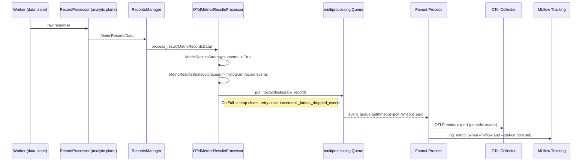
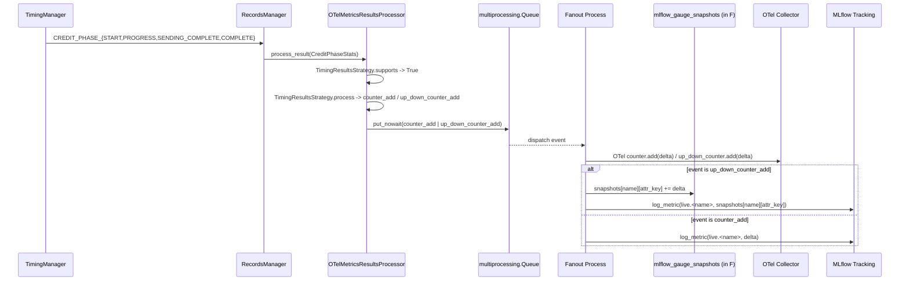
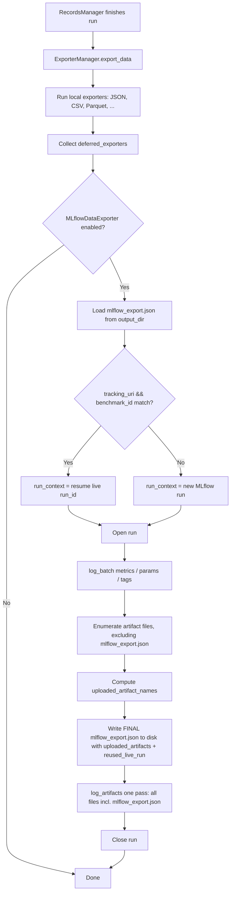

<!--
SPDX-FileCopyrightText: Copyright (c) 2025-2026 NVIDIA CORPORATION & AFFILIATES. All rights reserved.
SPDX-License-Identifier: Apache-2.0
-->

# Design Document — OTel + MLflow Telemetry Takeover

## Overview

After this change ships, AIPerf can publish metric and timing telemetry to an
OpenTelemetry (OTel) collector in near real time and to MLflow as a long-term
record of the run. On the command line this surfaces as three additive flag
clusters on the existing `aiperf profile` command (`--otel-url`, `--stream`,
`--mlflow*`) and one new flag on `aiperf plot` (`--mlflow-upload`). Internally,
the architectural skeleton is already in place in PR 656 head `628162da`: a
new `OTelMetricsResultsProcessor` runs inside `RecordsManager`, owns a
`multiprocessing.Queue`, and drives a single sibling process
(`run_otel_streaming_fanout`) that owns every OTel SDK and MLflow client.
After the local exporters finish, `MLflowDataExporter` reuses the live run
(when the tracking URI and benchmark ID match `mlflow_export.json`) and
uploads every file produced by the run, including the final metadata file
itself. This design document describes the shape that code must take after
the five round-2 defect fixes are applied; it does not redesign the feature
from scratch. Sections that read "already implemented, needs rebase only"
describe code that exists on `628162da` and must be preserved during the
rebase onto current `main`.

## Architecture

AIPerf's three-plane model (control, data, analytic) is unchanged. This
feature adds a fourth conceptual plane — the telemetry plane — that runs
alongside the analytic plane and is owned by a single child process spawned
by `OTelMetricsResultsProcessor`. The telemetry plane has two sinks (OTel
collector, MLflow tracking server) and three input channels (record metrics,
credit-phase timing metrics, post-run artifact upload). All three input
channels converge on the same fanout process while the run is live; the
post-run artifact upload runs later from `ExporterManager` and uses the
metadata file the fanout process wrote.

The telemetry plane is strictly append-only. It cannot block the hot path
(`Worker -> RecordProcessor -> RecordsManager`) and cannot fail the run if
the OTel collector is unreachable. All failure modes resolve to "log a
warning and continue" except for misconfiguration (invalid URL scheme,
missing optional dependency when explicitly requested), which is rejected
before the fanout process spawns.

### Data Flow: Record Telemetry (Requirement 1)



### Data Flow: Timing Telemetry (Requirement 1, 5, 7.2)



### Data Flow: Post-Run MLflow Artifact Upload (Requirement 4, 7.3)



The "write final metadata before upload" ordering at steps N -> O is the
fix for Requirement 7.3. The invariant it establishes is that the bytes on
disk after step N equal the bytes MLflow stores at step O.

## Components and Interfaces

This section enumerates every new or modified module. Each subsection cites
the requirement(s) it satisfies and marks whether the PR 656 shape is
preserved as-is or must change for a round-2 fix.

### `post_processors/otel_metrics_results_processor.py`

**Status:** already implemented, needs the Requirement 7.4 regression test
and the Requirement 8.4 rename audit; code shape otherwise preserved.

**Responsibility:** Register as a `results_processor` plugin, iterate
strategies to decide which records to emit, and feed the fanout queue.
Runs inside the `RecordsManager` process.

**Public surface (interface signatures):**

```python
class OTelMetricsResultsProcessor(ResultsProcessorProtocol, FlushableResultsProcessorProtocol):
    def __init__(self, user_config: UserConfig, service_config: ServiceConfig) -> None: ...

    async def process_result(
        self, record_data: MetricRecordsData | CreditPhaseStats,
    ) -> None: ...

    async def flush(self, *, force: bool = False) -> None: ...

    @on_init
    async def _start_fanout_process(self) -> None: ...

    @on_stop
    async def _stop_fanout_process(self) -> None: ...

    def _get_or_create_histogram(
        self, name: str, unit: str, description: str,
    ) -> _FanoutHistogramInstrument: ...

    def _get_or_create_counter(
        self, name: str, unit: str, description: str,
    ) -> _FanoutAddInstrument: ...

    def _get_or_create_up_down_counter(
        self, name: str, unit: str, description: str,
    ) -> _FanoutAddInstrument: ...

    def _enqueue_event(self, event: FanoutEvent) -> None: ...
```

**Design notes:**
- `_fanout_queue_maxsize = Environment.OTEL.MAX_BUFFERED_RECORDS` and the
  queue is constructed as
  `context.Queue(maxsize=self._fanout_queue_maxsize)`. The regression test
  in Requirement 11 sets the env var to 1 and asserts
  `queue._maxsize == 1` after `_start_fanout_process`. Satisfies
  Requirement 7.4.
- Backpressure on the hot path: `put_nowait(event)` → on `queue.Full` call
  `_drop_oldest_fanout_event()` (one `get_nowait()`), retry `put_nowait`
  once; increment `_fanout_dropped_events` exactly once per dropped event;
  log at counts 1, 100, 1000 using `self.warning` with a lambda. Never
  block. Satisfies Requirement 2.2 and Requirement 7.4.
- `_timing_counter_state: dict[tuple[CreditPhase, str], float]` and
  `_timing_gauge_state: dict[tuple[CreditPhase, str], float]` back the
  counter-delta and gauge-delta bookkeeping. The gauge-delta emission is
  consumed by `TimingResultsStrategy`. Satisfies Requirement 5 and is
  unchanged by the Requirement 7.2 fix (the fix lives in the fanout
  process; the processor continues to emit deltas).
- Process-spawn daemon workaround: current code does
  `mp.current_process().daemon = False` before spawn and restores it
  after, with a fallback to `mp.current_process()._config["daemon"]` if
  the assertion fires. Keep this. The "why" is that some test fixtures
  run inside daemonic multiprocessing contexts and
  `Process(daemon=True)` refuses to spawn children. Satisfies
  Requirement 1.2.

**Requirement map:** 1.1, 1.2, 1.5, 1.6, 2.1, 2.2, 5.5, 7.4, 8.4.

### `post_processors/otel_streaming_fanout.py`

**Status:** core loop already implemented; Requirements 7.1 and 7.2 require
changes to the main loop (monotonic-clock flush driver) and the MLflow
sink (cumulative gauge snapshots).

**Responsibility:** Child-process entrypoint that owns all OTel exporters
and, when `--mlflow` is set, the live MLflow sink. Dispatches events,
drives flushes, writes `mlflow_export.json`.

**Public surface (interface signatures):**

```python
def run_otel_streaming_fanout(
    event_queue: "multiprocessing.Queue[FanoutEvent]",
    config: OTelStreamingFanoutConfig,
) -> None:
    """Entry point; runs until a shutdown event is received."""

def _build_meter_provider(config: OTelStreamingFanoutConfig) -> "MeterProvider": ...

def _build_mlflow_context(config: OTelStreamingFanoutConfig) -> MLflowFanoutState | None: ...

def _dispatch_event(
    event: FanoutEvent,
    otel_state: OTelFanoutState,
    mlflow_state: MLflowFanoutState | None,
) -> None: ...

def _maybe_flush(
    mlflow_state: MLflowFanoutState | None,
    *,
    now: float,
    force: bool,
    config: OTelStreamingFanoutConfig,
) -> None:
    """Flush if buffer >= max_batch_records OR (now - last_flush) >= export_interval_seconds OR force."""

def _flush_mlflow_metrics(mlflow_state: MLflowFanoutState) -> None: ...

def _write_mlflow_metadata(
    state: MLflowFanoutState, *, path: Path,
) -> None:
    """orjson.dumps({tracking_uri, experiment_name, run_id, run_name, benchmark_id,
       uploaded_artifacts: [], reused_live_run: false})."""
```

**Requirement 7.1 design — flush driver.**
The main loop maintains `last_flush_monotonic: float = time.monotonic()`.
After every event dispatched (whether the event was drained from the queue
or a `queue.Empty` was raised on `get`), the loop calls
`_maybe_flush(mlflow_state, now=time.monotonic(), force=False, config=config)`.
`_maybe_flush` returns True when either:

- `len(mlflow_state.buffer) >= config.max_batch_records`
- `(now - last_flush_monotonic) >= config.export_interval_seconds`

When the branch fires, the function flushes, then resets
`last_flush_monotonic = now`. This is the **only** reliable driver under
sustained traffic, and it also handles the idle case because the
`queue.get(timeout=poll_timeout_sec)` wakes up regularly. The existing
count-based check in `_append_mlflow_metric` is retained as a fast inner
path but is no longer load-bearing. Explicit `flush` and `shutdown` events
still force a flush (`force=True`). Satisfies Requirement 7.1.

**Requirement 7.2 design — cumulative MLflow gauges.**
The MLflow sink maintains
`mlflow_gauge_snapshots: dict[str, dict[AttributeKey, float]]` where:

```python
AttributeKey = tuple[tuple[str, str], ...]

def _attribute_key(attrs: dict[str, object]) -> AttributeKey:
    # Hashable canonical form. Non-hashable values coerced to str; matches
    # existing resource-attribute construction in OTelMetricsResultsProcessor.
    return tuple(sorted(
        (str(k), str(v)) for k, v in (attrs or {}).items()
    ))
```

On an `up_down_counter_add` event with `(name, delta, attrs)`:

1. `key = _attribute_key(attrs)`
2. `snapshots = mlflow_gauge_snapshots.setdefault(name, {})`
3. `snapshots[key] = snapshots.get(key, 0.0) + delta`
4. If `abs(snapshots[key]) < 1e-9`, delete `snapshots[key]` to bound memory.
5. Otherwise, log `live.<name>` to MLflow with the cumulative value
   `snapshots[key]`.

The OTel branch is unchanged: `up_down_counter.add(delta, attrs)` keeps
delta semantics (correct per OTel spec). Satisfies Requirement 7.2 and
Requirement 3.1.

**Requirement 3.3 design — metadata file.**
After creating the MLflow run but before the first metric dispatch, the
fanout writes `mlflow_export.json` via
`orjson.dumps({..., uploaded_artifacts: [], reused_live_run: false})`. The
post-run exporter is responsible for the final rewrite (see
`MLflowDataExporter`). Satisfies Requirement 3.3 and Requirement 8.5.

**Lifecycle.** The fanout loop terminates when a `shutdown` event is
received: drain remaining queue entries, force-flush OTel + MLflow, close
SDK exporters, close the MLflow run context. Total time must stay under
`config.request_timeout_seconds + 5.0` seconds. Satisfies Requirement 2.4.

**Error handling.** Transient OTLP export errors are caught at the SDK
boundary and re-raised only at `log.warning` level. The loop continues.
Satisfies Requirement 2.5.

**Requirement map:** 1.2, 2.1, 2.3, 2.4, 2.5, 3.1, 3.2, 3.3, 3.4, 7.1,
7.2, 8.5.

### `post_processors/strategies/core.py`

**Status:** already implemented; interface preserved.

**Responsibility:** Declare `OTelResultsStrategyProtocol` and the
`OTelStrategyContextProtocol` callback surface that strategies use to
enqueue events.

**Public surface:**

```python
class OTelResultsStrategyProtocol(Protocol):
    def supports(self, record_data: MetricRecordsData | CreditPhaseStats) -> bool: ...
    async def process(
        self,
        record_data: MetricRecordsData | CreditPhaseStats,
        ctx: OTelStrategyContextProtocol,
    ) -> None: ...


class OTelStrategyContextProtocol(Protocol):
    @property
    def resource_attributes(self) -> Mapping[str, str]: ...

    def enqueue(self, event: FanoutEvent) -> None: ...

    def get_or_create_histogram(
        self, name: str, unit: str, description: str,
    ) -> _FanoutHistogramInstrument: ...

    def get_or_create_counter(
        self, name: str, unit: str, description: str,
    ) -> _FanoutAddInstrument: ...

    def get_or_create_up_down_counter(
        self, name: str, unit: str, description: str,
    ) -> _FanoutAddInstrument: ...

    def counter_delta(self, phase: CreditPhase, metric_name: str, cumulative: float) -> float:
        """Maintains _timing_counter_state; emits non-negative delta, or the new value on reset."""

    def gauge_delta(self, phase: CreditPhase, metric_name: str, cumulative: float) -> float:
        """Maintains _timing_gauge_state; emits signed delta."""
```

The processor iterates registered strategies in priority order and hands
off to the first one whose `supports(record_data)` returns True. Timing-aware
processors are the ones whose strategies accept `CreditPhaseStats`;
`RecordsManager` collects them into `_timing_results_processors` so that
`CREDIT_PHASE_*` events are routed only to those processors.

**Requirement map:** 5.1, 5.4, 5.5.

### `post_processors/strategies/metric_results.py`

**Status:** already implemented; preserved.

**Responsibility:** Map per-record `MetricRecordsData` to OTel histogram
records. One histogram per metric; one `record()` call per numeric value in
`coerce_metric_values(record)`.

**Requirement 1.6 design.** `MetricResultsStrategy.process` short-circuits
when `coerce_metric_values` returns an empty list (no numeric values).
The processor never enqueues a histogram event with an empty payload.

**Requirement map:** 1.5, 1.6, 5.2.

### `post_processors/strategies/timing_results.py`

**Status:** already implemented; no code shape change needed for
Requirement 7.2 (the fix is in the fanout sink).

**Responsibility:** Map `CreditPhaseStats` (phase counters and phase
gauges) to OTel counter-delta and up-down-counter-delta events under the
`aiperf.timing.*` namespace.

**Design note (Requirement 7.2 boundary).** `_GAUGE_FIELDS` continues to
emit deltas because the OTel up-down-counter correctly interprets deltas.
The MLflow side compensates by accumulating the deltas per
`(metric, attribute_key)` inside the fanout process. This strategy file
does not change.

**Requirement map:** 1.5, 5.3, 7.2 (boundary only), 10.6.

### `post_processors/strategies/__init__.py`

Re-exports `MetricResultsStrategy`, `TimingResultsStrategy`, and
`OTelResultsStrategyProtocol`. **Status:** already implemented; preserved.
Satisfies Requirement 5.4.

### `post_processors/protocols.py`

**Status:** already implemented; preserved.

`ResultsProcessorProtocol.process_result` accepts
`MetricRecordsData | CreditPhaseStats`. New
`FlushableResultsProcessorProtocol` declares `async flush(*, force: bool = False)`.
`RecordsManager` dispatches to processors based on these two protocols
(see `records_manager.py` below). Satisfies Requirement 5.5.

### `records/records_manager.py`

**Status:** modified by PR 656. Requirement 8.2 removes the stale
`# Flushes any buffered data` comment; all other behavior preserved.

**Responsibility:** Collect timing-capable results processors into
`_timing_results_processors`, dispatch `CreditPhaseStats` on
`CREDIT_PHASE_{START,PROGRESS,SENDING_COMPLETE,COMPLETE}`, and flush
flushable processors via `_flush_metric_results_processors(force=True)` in
`_process_results`.

**Requirement map:** 1.1, 5.5, 8.2.

### `exporters/mlflow_data_exporter.py`

**Status:** modified by PR 656. Requirement 7.3 requires a **reordering**
of `_export_sync`. Requirement 4.7 requires collapsing the duplication
flagged in CodeRabbit review 2867380366 into this single exporter.

**Responsibility:** Post-run MLflow artifact upload. Runs from
`ExporterManager` in the `deferred_exporters` phase. Reuses the live run
when the metadata file matches.

**Public surface:**

```python
class MLflowDataExporter(DataExporterProtocol):
    def __init__(self, user_config: UserConfig, service_config: ServiceConfig) -> None: ...

    async def export(self, *, output_dir: Path, benchmark_id: str) -> None: ...

    def _export_sync(self, *, output_dir: Path, benchmark_id: str) -> None:
        """Orchestrates the nine-step sequence below."""

    def _load_existing_metadata(self, output_dir: Path) -> MLflowMetadata | None: ...

    def _resolve_run_context(
        self, metadata: MLflowMetadata | None, benchmark_id: str,
    ) -> _MLflowRunContext: ...

    def _enumerate_artifacts(
        self, output_dir: Path, *, exclude: Iterable[str],
    ) -> list[Path]: ...

    def _write_final_metadata(
        self, *, output_dir: Path, run_context: _MLflowRunContext,
        uploaded_artifact_names: list[str], reused_live_run: bool,
    ) -> None: ...
```

**Requirement 7.3 design — nine-step ordering in `_export_sync`:**

1. Load existing `mlflow_export.json` (if any) via `orjson.loads`.
2. Determine reuse decision: reuse iff
   `metadata.tracking_uri == config.tracking_uri AND metadata.benchmark_id == benchmark_id`
   (Requirement 4.2, 11.7).
3. Resolve `run_context` (reuse live `run_id` vs new run).
4. Open the MLflow run (`mlflow.start_run(run_id=...)` or `mlflow.start_run(...)`).
5. Log batch metrics, params, tags (`mlflow.log_batch`,
   `mlflow.set_tags`, `mlflow.log_params`).
6. Enumerate artifact files using
   `mlflow_resolved_artifact_globs`, **excluding** `mlflow_export.json`
   (Requirement 4.4).
7. Compute `uploaded_artifact_names = [p.name for p in artifacts] + ["mlflow_export.json"]`.
8. Write final `mlflow_export.json` to disk with the final
   `uploaded_artifacts` list + `reused_live_run` flag using
   `orjson.dumps` (Requirements 7.3, 8.5).
9. Upload all artifacts including the now-final `mlflow_export.json`
   in a single `mlflow.log_artifacts(output_dir)` pass so that the bytes
   uploaded match the bytes on disk. Close the run.

**Invariant (Requirement 7.3):** The file written in step 8 is
bit-for-bit identical to the file stored in MLflow after step 9. The
integration test in Requirement 11.9 verifies this.

**Requirement 4.7 — deduplication.** Any `export_mlflow()` free function
or duplicated helper observed in PR 656 head is collapsed into
`MLflowDataExporter._export_sync`; `ExporterManager.export_data` invokes
the exporter through the `deferred_exporters` list only.

**Error handling.** Raises `DataExporterDisabled` if MLflow is missing
AND `--mlflow` was requested. Otherwise logs a warning and returns
without failing the run. Satisfies Requirement 3.4 and Requirement 4.

**Requirement map:** 3.3, 3.5, 4.1-4.7, 7.3, 8.1, 8.5.

### `exporters/exporter_manager.py`

**Status:** modified by PR 656; preserved.

**Responsibility:** Collect `MLflowDataExporter` into a
`deferred_exporters` list and run it after local exporters finish writing.

**Requirement map:** 4.1, 4.7.

### `common/config/user_config.py`

**Status:** modified by PR 656; Requirement 1.8 adds `min_length=1` on
`EndpointConfig.model_names`; Requirement 8.1 fixes the return type of
`mlflow_resolved_artifact_globs`; Requirement 8.4 removes callers of the
renamed `otel_streaming_enabled` property.

**New CLI fields (already in PR 656, preserved):**
- `--otel-url: str | None`
- `--stream: {default,metrics,timing,off}` — defaults to `default`
- `--mlflow: bool`
- `--mlflow-tracking-uri: str | None`
- `--mlflow-experiment: str | None`
- `--mlflow-run-name: str | None`
- `--mlflow-tag: list[str]` (key=value, multi-use)
- `--mlflow-upload: bool` (plot command only)

**New properties (already in PR 656, preserved):**
- `otel_metrics_url -> str | None`
- `otel_collector_enabled -> bool`
- `otel_stream_metrics_enabled -> bool`
- `otel_stream_timing_enabled -> bool`
- `mlflow_enabled -> bool`
- `mlflow_tags_dict -> dict[str, str]`
- `mlflow_resolved_artifact_globs -> list[str] | tuple[str, ...]`
  (Requirement 8.1)

**Helper:** `_normalize_otel_metrics_url(raw: str) -> str` — accepts
`host`, `host:port`, `http://host[:port][/path]`,
`https://host[:port][/path]`; rejects any other scheme with a descriptive
error; guarantees the returned URL ends with `/v1/metrics` exactly once.
Satisfies Requirements 1.3 and 1.4.

**Requirement 1.8.** `EndpointConfig.model_names: list[str] = Field(min_length=1, ...)`.
Existing callers pass non-empty lists via
`_parse_gpu_telemetry_config` and related helpers; searching for `None`
literals assigned to `model_names` returns zero hits on `628162da`.
Impact: zero behavioral change on the happy path; empty-list invocations
now fail fast with a Pydantic validation error.

**Requirement 8.4 audit.** A `grepSearch` for `otel_streaming_enabled`
must return zero hits in `src/aiperf/**`. The property is renamed to
`otel_collector_enabled`.

**Requirement map:** 1.3, 1.4, 1.8, 3.2, 3.5, 4.2, 4.4, 8.1, 8.4, 8.6.

### `common/config/config_defaults.py`

**Status:** already implemented; preserved.

Adds `MLflowDefaults` dataclass with
`EXPORT_METADATA_FILE = Path("mlflow_export.json")` and
`DEFAULT_ARTIFACT_GLOBS: tuple[str, ...]`. Satisfies Requirements 3.3,
4.4.

### `common/environment.py`

**Status:** already implemented; preserved. Requirement 10.2 regenerates
`docs/environment-variables.md` to include the four new vars.

`_OTelSettings`:
- `FLUSH_INTERVAL_SECONDS: float = 2.0`
- `MAX_BATCH_RECORDS: int = 500`
- `MAX_BUFFERED_RECORDS: int = 10000`
- `REQUEST_TIMEOUT_SECONDS: float = 10.0`

Exposed env vars: `AIPERF_OTEL_FLUSH_INTERVAL_SECONDS`,
`AIPERF_OTEL_MAX_BATCH_RECORDS`, `AIPERF_OTEL_MAX_BUFFERED_RECORDS`,
`AIPERF_OTEL_REQUEST_TIMEOUT_SECONDS`. Satisfies Requirements 2.1, 2.3,
2.4.

### `common/optional_dependencies.py`

**Status:** already implemented; Requirement 8.3 confirms that
`install_optional_dependency_hint` leads with `pip install aiperf[...]`.

Helpers:
- `install_optional_dependency_hint(extra: str) -> str` —
  returns `"pip install aiperf[<extra>]"` first, `"uv add ..."` second.
- `mlflow_dependency_message() -> str`
- `otel_dependency_message() -> str`

**Import-time safety rule.** All OTel/MLflow imports live inside function
bodies guarded by these helpers. No module under `src/aiperf/**` imports
`opentelemetry` or `mlflow` at module top level. Satisfies Requirement
1.7.

**Requirement map:** 1.7, 3.4, 8.3.

### `plot/cli_runner.py`

**Status:** modified by PR 656; Requirement 7.5 requires moving the
dashboard + mlflow_upload mutual-exclusion check to the front of
`run_plot_controller`.

**Public surface:**

```python
def run_plot_controller(user_config: UserConfig) -> None:
    # 1. Resolve paths
    # 2. Coerce mode/theme
    # 3. If user_config.dashboard and user_config.mlflow_upload:
    #        raise ValueError("--dashboard and --mlflow-upload are mutually exclusive")
    # 4. If user_config.mlflow_upload:
    #        target = _resolve_mlflow_upload_target(user_config)
    # 5. controller = PlotController(...)
    # 6. controller.run()
    # 7. If user_config.mlflow_upload:
    #        _upload_generated_plots_to_mlflow(controller.generated_plots, target)

def _resolve_mlflow_upload_target(user_config: UserConfig) -> _MLflowPlotTarget: ...

def _upload_generated_plots_to_mlflow(
    generated_plots: list[Path], target: _MLflowPlotTarget,
) -> None: ...
```

**Requirement 7.5 design.** Step 3 must run **before** step 5. The
existing check is relocated to the top of the function. `aiperf plot`
argument coercion in `src/aiperf/cli_commands/plot.py` mirrors this
order so that invalid combinations fail before `PlotController` is
constructed and its blocking HTTP server is started.

**Requirement 6 design.** `_resolve_mlflow_upload_target` validates that
either `--mlflow-run-id` was provided OR a valid `mlflow_export.json`
exists in the input directory; fails fast otherwise. Uses `orjson` for
all JSON I/O (Requirement 8.5). Honors `--mlflow-tracking-uri` as an
override of any URI read from the metadata file (Requirement 6.2).

**Requirement map:** 6.1, 6.2, 6.3, 6.4, 7.5.

### `plugin/plugins.yaml`

**Status:** modified by PR 656; preserved.

New entries:
- `results_processor.otel_metrics_streamer`
- `data_exporter.mlflow`

The `make generate-all-plugin-files` hook regenerates enum/overload/schema
artifacts; `make validate-plugin-schemas` enforces integrity. Satisfies
Requirement 10.3.

### `pyproject.toml`

**Status:** already implemented; preserved.

Optional extras:
- `aiperf[mlflow]` — `mlflow`
- `aiperf[otel]` — OpenTelemetry API + SDK + OTLP HTTP exporter
- Composable: `aiperf[mlflow,otel]`

README update lists all three forms. Satisfies Requirement 10.10.

## Data Models

### `OTelStreamingFanoutConfig`

Dataclass serialized across the process boundary via `multiprocessing`'s
pickle. `@dataclass(slots=True)` chosen because this is constructed once
per run.

```python
@dataclass(slots=True)
class OTelStreamingFanoutConfig:
    otel_metrics_url: str
    otel_headers: dict[str, str]
    resource_attributes: dict[str, str]
    export_interval_seconds: float  # from AIPERF_OTEL_FLUSH_INTERVAL_SECONDS
    request_timeout_seconds: float  # from AIPERF_OTEL_REQUEST_TIMEOUT_SECONDS
    max_batch_records: int          # from AIPERF_OTEL_MAX_BATCH_RECORDS
    max_buffered_records: int       # from AIPERF_OTEL_MAX_BUFFERED_RECORDS
    poll_timeout_sec: float
    stream_metrics_enabled: bool
    stream_timing_enabled: bool
    mlflow_enabled: bool
    mlflow_tracking_uri: str | None
    mlflow_experiment: str | None
    mlflow_run_name: str | None
    mlflow_tags: dict[str, str]
    mlflow_metadata_path: Path
    benchmark_id: str
```

### `MLflowMetadata` (schema for `mlflow_export.json`)

```python
class MLflowMetadata(TypedDict):
    tracking_uri: str
    experiment_name: str
    run_id: str
    run_name: str
    benchmark_id: str
    uploaded_artifacts: list[str]  # names relative to output_dir
    reused_live_run: bool
```

Reads use `orjson.loads`. Writes use `orjson.dumps`. Satisfies
Requirement 3.3, 4.5, 8.5.

### Fanout event schema

One dict shape per event type; all are dicts (not Pydantic models) so they
serialize cheaply across the process boundary.

```python
FanoutEvent = dict[str, Any]

# histogram_record
{
    "type": "histogram_record",
    "name": str,
    "unit": str,
    "description": str,
    "value": float,
    "attributes": dict[str, str],
}

# counter_add (monotonic counter delta; MLflow logs delta as-is)
{
    "type": "counter_add",
    "name": str,
    "unit": str,
    "description": str,
    "value": float,  # non-negative delta, or snapshot value on reset
    "attributes": dict[str, str],
}

# up_down_counter_add (gauge delta; MLflow accumulates per attribute key)
{
    "type": "up_down_counter_add",
    "name": str,
    "unit": str,
    "description": str,
    "value": float,  # signed delta
    "attributes": dict[str, str],
}

# flush (forces OTel flush + MLflow flush)
{"type": "flush"}

# shutdown (drains then exits)
{"type": "shutdown"}
```

### Strategy state dicts

Live inside `OTelMetricsResultsProcessor`:

```python
_timing_counter_state: dict[tuple[CreditPhase, str], float]
    # key: (phase, metric_name); value: last cumulative emitted
    # On cumulative_now < last (reset), emit cumulative_now as the new delta.
    # Otherwise emit cumulative_now - last and update last.

_timing_gauge_state: dict[tuple[CreditPhase, str], float]
    # Same shape; emits signed delta (cumulative_now - last).
```

Live inside the fanout process:

```python
mlflow_gauge_snapshots: dict[str, dict[AttributeKey, float]]
    # Per-metric, per-attribute-key cumulative absolute value derived
    # from up_down_counter_add deltas. Keys with |value| < 1e-9 are
    # removed to bound memory. Used only for MLflow; OTel receives the
    # raw delta.

mlflow_buffer: list[tuple[str, float, int]]
    # (metric_key, value, timestamp_ms) entries pending flush.
```


## Correctness Properties

*A property is a characteristic or behavior that should hold true across all
valid executions of a system — essentially, a formal statement about what
the system should do. Properties serve as the bridge between human-readable
specifications and machine-verifiable correctness guarantees.*

Property-based testing IS appropriate for this feature. The five pieces that
vary meaningfully with input — URL normalization, metric value coercion,
timing delta/gauge accounting, fanout queue backpressure, metadata reuse —
are pure functions or bounded stateful loops that are cheap to run 100+
iterations against. Wiring, lifecycle, and documentation criteria are
covered by example/smoke tests instead (see Testing Strategy).

Each property below has the format:
property number, title, quantified invariant, requirements it validates,
source-of-truth function, and the test location where it will be implemented.

### Property 1: OTel URL normalization is host-preserving and idempotent

*For any* input `u` drawn from the set of bare hosts, `host:port` strings,
`http(s)://host[:port][/path]` URLs, the result of
`_normalize_otel_metrics_url(u)` ends with the path segment `/v1/metrics`
exactly once AND `urlparse(result).hostname == urlparse_input.hostname` AND
`urlparse(result).port == urlparse_input.port` AND
`_normalize_otel_metrics_url(_normalize_otel_metrics_url(u)) == _normalize_otel_metrics_url(u)`.
*For any* input whose scheme is not in `{http, https}` (e.g. `file`, `ftp`,
`grpc`, `ws`, `tcp`), `_normalize_otel_metrics_url` raises a configuration
error before Fanout_Process is spawned.

**Validates: Requirements 1.3, 1.4**
**Source of truth:** `user_config._normalize_otel_metrics_url`
**Test location:** `tests/unit/common/config/test_user_config_otel_url.py`

### Property 2: `coerce_metric_values` keeps only numeric-non-boolean entries

*For any* input value of type `int | float | bool | list[T] | T`, where `T`
ranges over numeric and non-numeric scalars,
`coerce_metric_values(value)` satisfies:

- Booleans (including bool items inside lists) are dropped.
- A single numeric non-bool scalar produces a singleton list of floats.
- A mixed list retains exactly those entries that are numeric AND not bool.
- Non-numeric non-bool scalars and containers (strings, dicts, tuples,
  None) produce `[]`.

**Validates: Requirements 1.6, 11.3**
**Source of truth:**
`otel_metrics_results_processor.OTelMetricsResultsProcessor._coerce_metric_values`
(or the module-level helper the processor calls)
**Test location:**
`tests/unit/post_processors/test_coerce_metric_values_property.py`

### Property 3: Timing counter delta accounting is non-negative and sums to cumulative

*For any* finite sequence of cumulative counter snapshots
`s_0, s_1, ..., s_n` where each `s_i >= 0` and resets are modelled as
`s_i < s_{i-1}` for some `i`, the emitted deltas `d_i = delta_fn(s_i)`
computed by `_timing_counter_state` satisfy:

- `d_i >= 0` for every `i` (deltas never go negative).
- On reset, `d_i == s_i` (the new cumulative becomes the delta).
- Otherwise `d_i == s_i - last_observed_for(phase, metric)`.
- `sum(d_0..d_n) == s_n` when no resets occur.
- `sum(d_0..d_n) >= s_n` when resets occur (cumulative loss is counted
  as new deltas post-reset, which is the defined semantics).

All emitted counter events carry metric names with the prefix
`aiperf.timing.`.

**Validates: Requirements 5.3, 11.4**
**Source of truth:**
`OTelStrategyContextProtocol.counter_delta` (implemented inside
`OTelMetricsResultsProcessor`)
**Test location:**
`tests/unit/post_processors/test_timing_counter_delta_property.py`

### Property 4: MLflow gauge snapshot equals cumulative sum of deltas per attribute key

*For any* finite sequence of `up_down_counter_add` events
`(name_i, delta_i, attrs_i)` consumed by the fanout gauge sink, at every
intermediate step `k` and for every `(name, attr_key)` pair, the value
`mlflow_gauge_snapshots[name][attr_key]` (or `0.0` if the key has been
evicted for `|value| < 1e-9`) equals `sum(delta_i for i <= k such that name_i == name AND _attribute_key(attrs_i) == attr_key)`.
Additionally, the aggregate snapshot per `name` (sum of values across
all attribute keys, treating evicted keys as 0) equals the running sum of
all deltas for that name.

**Validates: Requirements 7.2, 11.5**
**Source of truth:** The gauge branch of `_dispatch_event` in
`otel_streaming_fanout.py`
**Test location:**
`tests/unit/post_processors/test_mlflow_gauge_snapshot_property.py`

### Property 5: Fanout queue backpressure drops oldest and counts exactly

*For any* capacity `N >= 1`, *for any* sequence of `E` enqueue events
dispatched against a queue that is never drained by a consumer, the
observed queue length after processing each event lies in `[0, N]` AND
`_fanout_dropped_events == max(0, E - N)` AND every drop corresponds to
exactly one `get_nowait()` + `put_nowait()` retry pair (no doubled
counting, no lost increments).

**Validates: Requirements 2.2, 7.4, 11.6**
**Source of truth:**
`OTelMetricsResultsProcessor._enqueue_event` plus
`_drop_oldest_fanout_event`
**Test location:**
`tests/unit/post_processors/test_fanout_backpressure_property.py`

### Property 6: MLflow live-run reuse rule

*For any* pair of `MLflow_Metadata_File` and current `UserConfig`, the
post-run exporter reuses the live `run_id` if and only if
`metadata.tracking_uri == user_config.mlflow_tracking_uri` AND
`metadata.benchmark_id == current_benchmark_id`. In the reuse case,
`reused_live_run == True` in the final metadata; otherwise a new run is
created and `reused_live_run == False`.

**Validates: Requirements 4.2, 11.7**
**Source of truth:** `MLflowDataExporter._resolve_run_context`
**Test location:**
`tests/unit/exporters/test_mlflow_live_run_reuse_property.py`

### Property 7: MLflow live flush is bounded by count AND monotonic time

*For any* sequence of events dispatched into the fanout over a synthetic
monotonic clock, the number of flush invocations over a window of duration
`W` seconds is at least `floor(W / config.export_interval_seconds)`,
regardless of whether the queue was ever empty during the window. In
addition, any time the buffer reaches
`config.max_batch_records` entries, a flush is invoked before the next
event is appended. These are the only two conditions that trigger an
implicit flush; explicit `flush` and `shutdown` events always force a
flush.

**Validates: Requirement 7.1**
**Source of truth:** `_maybe_flush` in `otel_streaming_fanout.py`
**Test location:**
`tests/unit/post_processors/test_fanout_flush_trigger_property.py`

### Property 8: Uploaded `mlflow_export.json` equals final local copy byte-for-byte

*For any* completed run of `MLflowDataExporter._export_sync`, the bytes
that the mocked `mlflow.log_artifacts` call receives for
`mlflow_export.json` equal `Path(output_dir / "mlflow_export.json").read_bytes()`
at the moment `_export_sync` returns. Additionally, the observed call
order on the MLflow client is:
`[log_batch | log_params | set_tags]* -> file-system write -> log_artifacts(output_dir)`,
with `log_artifacts` called exactly once.

**Validates: Requirements 4.5, 4.6, 7.3**
**Source of truth:** `MLflowDataExporter._export_sync`
**Test location:**
`tests/unit/exporters/test_mlflow_metadata_equality_property.py` plus
integration test `tests/integration/exporters/test_mlflow_metadata_roundtrip.py`

## Error Handling

This table enumerates every failure mode introduced by the feature, the
resolution, the user-facing surface, and whether the run continues.

| Failure mode | Where caught | User-facing surface | Run continues? |
| --- | --- | --- | --- |
| MLflow extra missing AND `--mlflow` set | `optional_dependencies.mlflow_dependency_message()` checked at config-resolve time in `user_config` and at `MLflowDataExporter.__init__` | Click-style error: `Install the MLflow extra: pip install aiperf[mlflow]` | No, exits before workers start |
| OTel extra missing AND `--otel-url` set | `optional_dependencies.otel_dependency_message()` checked at config-resolve time in `user_config` | Click-style error: `Install the OTel extra: pip install aiperf[otel]` | No, exits before workers start |
| OTel extra missing in Fanout_Process only (race) | `run_otel_streaming_fanout` catches ImportError at guard | Warning log; fanout process exits cleanly | Yes (telemetry disabled, run continues) |
| Invalid `--otel-url` scheme | `_normalize_otel_metrics_url` raises `ValueError` | Config error: `--otel-url scheme must be http or https` | No, exits before workers start |
| `--otel-url` host unreachable during run | OTLP exporter in Fanout_Process catches and logs at warning | Warning log; records continue; dropped events counter increments on backpressure | Yes |
| MLflow tracking URI unreachable during run | `mlflow.log_metric` in Fanout_Process wraps in try/except; logs at warning | Warning log; live logging degrades to no-op | Yes |
| `mlflow_export.json` malformed | `MLflowDataExporter._load_existing_metadata` catches `orjson.JSONDecodeError` | Warning: `malformed mlflow_export.json; creating new MLflow run` | Yes (new run instead of reuse) |
| `mlflow_export.json` missing when `aiperf plot --mlflow-upload` run | `_resolve_mlflow_upload_target` raises `ValueError` | CLI error: `--mlflow-upload requires --mlflow-run-id OR a valid mlflow_export.json in the input directory` | No, exits before plots render |
| `EndpointConfig.model_names == []` | Pydantic `min_length=1` validator | Validation error: `model_names must contain at least one model` | No, exits at config parse |
| Fanout_Process spawn fails (OS error) | `_start_fanout_process` catches `OSError` / `RuntimeError` | Error log, lifecycle fails; `RecordsManager` still starts | Yes, but OTel telemetry is disabled for the run |
| Fanout queue full under sustained load | `_enqueue_event` drops oldest and increments `_fanout_dropped_events`; logs at counts 1, 100, 1000 | Warning log listing dropped event counter | Yes |
| Transient OTLP export error | Caught by SDK reader; re-logged at warning by Fanout_Process | Warning log | Yes |
| `--dashboard --mlflow-upload` combined | `run_plot_controller` raises `ValueError` at step 3 | CLI error: `--dashboard and --mlflow-upload are mutually exclusive` | No, exits before PlotController construction |
| `--stream` value outside `{default, metrics, timing, off}` | Cyclopts/Click argument parser | CLI usage error | No, exits at CLI parse |
| MLflow run creation fails post-spawn | `MLflowDataExporter._resolve_run_context` catches and logs | Warning log; exporter returns without upload | Yes |

## Testing Strategy

**Dual testing approach.** Unit tests cover wiring, validation, and
error paths with concrete examples. Property tests cover input-varying
logic with 100+ Hypothesis iterations per test. Integration tests run
the actual profile/plot paths against the in-repo mock server.

### Unit + Property Test Matrix

| Test | Kind | Property # | Validates Requirement | Location |
| --- | --- | --- | --- | --- |
| `test_normalize_otel_metrics_url_property` | property | P1 | 1.3, 1.4 | `tests/unit/common/config/test_user_config_otel_url.py` |
| `test_coerce_metric_values_property` | property | P2 | 1.6, 11.3 | `tests/unit/post_processors/test_coerce_metric_values_property.py` |
| `test_timing_counter_delta_property` | property | P3 | 5.3, 11.4 | `tests/unit/post_processors/test_timing_counter_delta_property.py` |
| `test_mlflow_gauge_snapshot_property` | property | P4 | 7.2, 11.5 | `tests/unit/post_processors/test_mlflow_gauge_snapshot_property.py` |
| `test_fanout_backpressure_property` | property | P5 | 2.2, 7.4, 11.6 | `tests/unit/post_processors/test_fanout_backpressure_property.py` |
| `test_mlflow_live_run_reuse_property` | property | P6 | 4.2, 11.7 | `tests/unit/exporters/test_mlflow_live_run_reuse_property.py` |
| `test_fanout_flush_trigger_property` | property | P7 | 7.1 | `tests/unit/post_processors/test_fanout_flush_trigger_property.py` |
| `test_mlflow_metadata_equality_property` | property | P8 | 4.5, 7.3 | `tests/unit/exporters/test_mlflow_metadata_equality_property.py` |
| `test_fanout_queue_maxsize_env` | example | — | 7.4 | `tests/unit/post_processors/test_fanout_queue_config.py` |
| `test_plot_dashboard_and_mlflow_upload_rejected` | example | — | 7.5, 11.10 | `tests/unit/plot/test_plot_cli_runner.py` |
| `test_mlflow_missing_dep_fails_fast` | example | — | 3.4 | `tests/unit/exporters/test_mlflow_data_exporter_deps.py` |
| `test_optional_dep_hint_leads_with_pip` | example | — | 8.3 | `tests/unit/common/test_optional_dependencies.py` |
| `test_no_otel_streaming_enabled_callers` | smoke | — | 8.4 | `tests/unit/common/test_otel_naming_sync.py` |
| `test_endpoint_config_model_names_min_length` | edge | — | 1.8 | `tests/unit/common/config/test_endpoint_config.py` |
| `test_records_manager_no_stale_comment` | smoke | — | 8.2 | `tests/unit/records/test_records_manager_style.py` |
| `test_no_otel_import_at_module_top_level` | smoke | — | 1.7 | `tests/unit/post_processors/test_import_safety.py` |

### Integration Tests

| Test | Validates Requirement | Location |
| --- | --- | --- |
| Live OTel export while records flow (mock OTLP sink receives at least one export before run completes) | 7.1 smoke, 11.8 | `tests/integration/post_processors/test_otel_live_export.py` |
| `aiperf profile --mlflow --mlflow-tracking-uri file://<tmp>` then assert uploaded `mlflow_export.json` equals final local copy byte-for-byte | 7.3, 11.9 | `tests/integration/exporters/test_mlflow_metadata_roundtrip.py` |
| `aiperf plot --mlflow-upload` against a temp MLflow store reuses the live run_id when metadata matches | 6.1, 6.2, 6.3 | `tests/integration/plot/test_plot_mlflow_upload.py` |

### Fixtures Needed

- `tests/unit/post_processors/conftest.py` — fake OTel scaffolding that
  substitutes `MeterProvider`, `OTLPMetricExporter`,
  `PeriodicExportingMetricReader`, and records every `record()` /
  `add()` call in memory. Used by property tests P3–P5, P7.
- `tests/unit/exporters/conftest.py` — in-memory MLflow client fixture
  (no real MLflow install required); captures
  `log_metric`, `log_params`, `set_tags`, `log_batch`, `log_artifacts`
  with call order preserved. Used by property tests P6, P8.
- `tests/integration/conftest.py` — fake OTLP HTTP sink (aiohttp test
  server) for integration tests; reuses existing mock server fixtures.

### Property Test Configuration

- Every property test uses Hypothesis with at least 100 examples
  (`@settings(max_examples=100)` or higher where appropriate).
- Every property test carries the tag comment:
  `# Feature: otel-mlflow-telemetry-takeover, Property {N}: {property_text}`
  referring back to the property numbering in this document.
- Property tests implement exactly ONE property each; additional
  behaviors go in sibling example tests.

## Documentation Plan

| Doc file | Content to add/update | Generator command | Requirement |
| --- | --- | --- | --- |
| `docs/cli-options.md` | New `--otel-url`, `--stream`, `--mlflow`, `--mlflow-tracking-uri`, `--mlflow-experiment`, `--mlflow-run-name`, `--mlflow-tag`, `--mlflow-upload` | `make generate-all-docs` | 10.1 |
| `docs/environment-variables.md` | `AIPERF_OTEL_FLUSH_INTERVAL_SECONDS`, `AIPERF_OTEL_MAX_BATCH_RECORDS`, `AIPERF_OTEL_MAX_BUFFERED_RECORDS`, `AIPERF_OTEL_REQUEST_TIMEOUT_SECONDS` | `make generate-all-docs` | 10.2 |
| `src/aiperf/plugin/generated/*` | New plugin entries: `results_processor.otel_metrics_streamer`, `data_exporter.mlflow` | `make generate-all-plugin-files` + `make validate-plugin-schemas` | 10.3 |
| `docs/architecture.md` | New subsection "Telemetry Plane" covering Fanout_Process, Strategy_Protocol dispatch via `--stream`, Deferred_MLflow_Path. Mermaid diagrams reused from this design. | hand-edit | 10.4 |
| `docs/dev/patterns.md` | New "Strategy Protocol Pattern" subsection with `MetricResultsStrategy` / `TimingResultsStrategy` example; "Drop-Oldest Fanout Queue" pattern. | hand-edit | 10.5 |
| `docs/metrics-reference.md` | New `aiperf.timing.*` namespace table: counter + gauge definitions, formulas, requirements. | hand-edit | 10.6 |
| `docs/tutorials/otel-mlflow.md` (new) | End-to-end tutorial: start a collector, start an MLflow tracking server, run `aiperf profile --otel-url ... --mlflow --mlflow-tracking-uri ...`, inspect live dashboard, run `aiperf plot --mlflow-upload` on the same output directory. Sections: Prerequisites, Setup OTel Collector, Setup MLflow, Run AIPerf, Live Dashboards, Plot Upload, Troubleshooting. | hand-edit | 10.7 |
| `README.md` | Tutorial index entry "OTel + MLflow live telemetry" linking to `docs/tutorials/otel-mlflow.md`; mention of `aiperf[mlflow]`, `aiperf[otel]`, `aiperf[mlflow,otel]` extras. | hand-edit | 10.8, 10.10 |
| `docs/index.yml` | Add `otel-mlflow.md` under the tutorials section so `tools/check_docs_index.py` passes. | hand-edit | 10.8 |
| `AGENTS.md`, `CLAUDE.md`, `.github/copilot-instructions.md`, `.cursor/rules/python.mdc` | No content change expected; re-check byte identity after editing any one. | `make check-agent-files-sync` | 10.9 |

### Tutorial Outline (`docs/tutorials/otel-mlflow.md`)

1. **What you will learn** — live metric streaming to OTel, live metric
   logging to MLflow, post-run artifact upload to MLflow, attaching
   plots to an existing MLflow run.
2. **Prerequisites** — `aiperf[mlflow,otel]`, an OTel collector (we
   recommend a local `otel-collector-contrib` Docker image), an MLflow
   tracking server (local `mlflow ui` on `file:./mlruns` is enough for
   the tutorial).
3. **Run a profile with telemetry enabled** — single command showing
   `--otel-url http://localhost:4318 --stream metrics --mlflow
   --mlflow-tracking-uri file:./mlruns --mlflow-experiment my-exp`.
4. **Inspect live OTel data** — sample Prometheus/Grafana snippet.
5. **Inspect live MLflow data** — screenshot of the run page with
   `live.*` metric scalars.
6. **Post-run artifact upload** — show the `mlflow_export.json` entry,
   the uploaded JSON/CSV files, and the final `reused_live_run: true`
   flag.
7. **Attach plots** — `aiperf plot --input-dir ./output --mlflow-upload`;
   show the artifacts appearing under the same run.
8. **Troubleshooting** — missing extras, unreachable collector, URL
   normalization examples, env var tuning for high-throughput runs.

## Rebase Strategy

The takeover preserves attribution and history hygiene per Requirement 9.
Steps are semantic, not shell commands.

1. **Fetch PR 656 head.** Add the `briefgaming/aiperf` fork as a remote
   and fetch branch `feat/otel-mlflow-tracking` at SHA `628162da`.
2. **Create the takeover branch.** Branch `<current-user>/otel-mlflow-tracking`
   from the current `main` HEAD at the moment work begins. The
   requirements document references `main` at `5b04befe` as a starting
   sample; actual target is the `main` HEAD at PR creation time.
3. **Cherry-pick or interactively re-apply PR 656 commits** onto the
   takeover branch. Because PR 656 is five commits ahead of its base,
   apply them in order and expect conflicts in:

   | File | Conflict semantic to apply |
   | --- | --- |
   | `src/aiperf/common/config/user_config.py` | Keep main's existing fields; add PR 656's `--otel-*`, `--mlflow-*`, `--stream` fields; re-import normalize helper; keep `min_length=1` on `EndpointConfig.model_names`. |
   | `src/aiperf/records/records_manager.py` | Keep main's handler changes since `8763c57c`; add PR 656's `_timing_results_processors` and credit-phase dispatch; remove the `# Flushes any buffered data` comment (Req 8.2). |
   | `src/aiperf/exporters/exporter_manager.py` | Keep main's export orchestration; add `deferred_exporters` list and MLflow invocation after local exporters; remove any duplicate `export_mlflow()` helper (Req 4.7). |
   | `src/aiperf/plugin/plugins.yaml` | Union of entries: keep main's entries, add `results_processor.otel_metrics_streamer` and `data_exporter.mlflow`; re-run `make generate-all-plugin-files`. |

4. **Apply round-2 defect fixes on top** as distinct commits (not
   squashed into the PR 656 content), so each fix is reviewable on its
   own:
   - `fix(telemetry): flush MLflow live metrics on monotonic interval` (Req 7.1)
   - `fix(telemetry): log cumulative gauge snapshots to MLflow` (Req 7.2)
   - `fix(telemetry): write mlflow_export.json before uploading artifacts` (Req 7.3)
   - `fix(telemetry): wire AIPERF_OTEL_MAX_BUFFERED_RECORDS to queue maxsize` (Req 7.4)
   - `fix(plot): reject --dashboard --mlflow-upload before controller start` (Req 7.5)
5. **Apply round-3 style fixes** as one `style(telemetry): ...` commit
   covering Req 8.1–8.6.
6. **Apply documentation updates** as one `docs(telemetry): ...` commit
   covering Req 10 and the new tutorial.
7. **Squash to final commit structure.** Either:
   - a single `feat(telemetry): live OTel metrics + MLflow export`
     commit (acceptable per Req 9.3), OR
   - one `feat(...)` plus the `fix(...)`/`style(...)`/`docs(...)`/`test(...)` commits
     above (preferred for review).
8. **Every commit on the branch includes:**
   - `Co-authored-by: Emmanuel Bashorun <bashorun.emma@gmail.com>` trailer
   - DCO sign-off (`-s`)
9. **Publish the branch.**
   - If push access exists on
     `briefgaming/aiperf:feat/otel-mlflow-tracking` (PR 656 allows
     `maintainer_can_modify`), update PR 656 in place; do **not**
     force-push over existing commits in `ai-dynamo/aiperf`; push only
     to the fork branch. Req 9.5, 9.6.
   - Otherwise, push `<current-user>/otel-mlflow-tracking` to the
     upstream repo and open a new PR that links to and closes PR 656.
10. **Pre-PR verification gates** run locally in this order before push
    (Req 12):
    - `ruff format . && ruff check --fix .`
    - `uv run pytest tests/unit/ -n auto`
    - `uv run pytest -m component_integration -n auto`
    - `make validate-plugin-schemas`
    - `make check-agent-files-sync`
    - `make generate-all-docs` (no diff)
    - `make generate-all-plugin-files` (no diff)
    - `pre-commit run --all-files`

## Open Questions / Risks

The following need user confirmation before tasks.md is written.

1. **PR in place vs new PR.** Requirement 9.5 says to update PR 656
   in place via `maintainer_can_modify` if push access exists,
   otherwise open a new PR that closes #656. Who confirms push access?
   If push access is uncertain at task-planning time, default to the
   "new PR closes #656" path and note in the tasks doc that the PR
   creation task switches branches depending on access.

2. **Tutorial naming.** Requirement 10.7 suggests
   `docs/tutorials/otel-mlflow.md`. The repo has no existing tutorial
   with a compound-topic name using a dash; existing names tend to be
   single-topic (`arrival-patterns.md`, `fixed-schedule.md`). Is
   `otel-mlflow.md` acceptable, or should we split into
   `otel-streaming.md` and `mlflow-integration.md`? Default: single
   file per Req 10.7 unless told otherwise.

3. **`docs/index.yml` ownership.** The Fern navigation file is
   regenerated by hand. Is any other feature-in-flight editing
   `docs/index.yml`? If yes, the docs commit in step 6 of the rebase
   must be serialized against that work to avoid conflicts.

4. **Tracking ticket ID (Taskei / `sim:`).** No `sim:` tracking ticket
   URL has been provided. Requirements and design can be completed
   without one, but commit messages that follow the Amazon-builder
   git conventions (user-rule) typically include a `sim:` footer.
   If this PR does not need one (because it lives in a GitHub
   upstream), confirm to omit it.

5. **`_flush_metric_results_processors(force=True)` semantics.**
   Requirement 11.4 is phrased around cumulative counter sequences
   with tolerated resets. Are counter resets an expected real-world
   input (e.g., phase transitions emitting a new cumulative from 0)?
   If yes, the property generator must cover reset sequences
   explicitly. Default: include resets in the generator; confirm if
   the wording is stricter.

6. **Fanout process spawn method.** The existing daemon workaround
   (`mp.current_process().daemon = False`) suggests a `spawn` or
   `fork`-in-daemonic-context issue. Do we need to pin
   `multiprocessing.get_context("spawn")` explicitly for
   platform-independent behavior on macOS CI, or is the current fallback
   sufficient?

7. **Byte-equality invariant for `mlflow_export.json` upload.**
   Requirement 7.3 asserts bit-for-bit equality. MLflow's
   `log_artifacts` compresses/copies files; on some backends the
   stored copy may have different trailing newlines or line endings.
   If the integration test in Req 11.9 reveals a normalization by the
   MLflow backend, we fall back to asserting `orjson.loads` equality
   of parsed JSON. Confirm whether "bit-for-bit" in Req 7.3 is intended
   as a strict requirement or a proxy for "same logical content."
